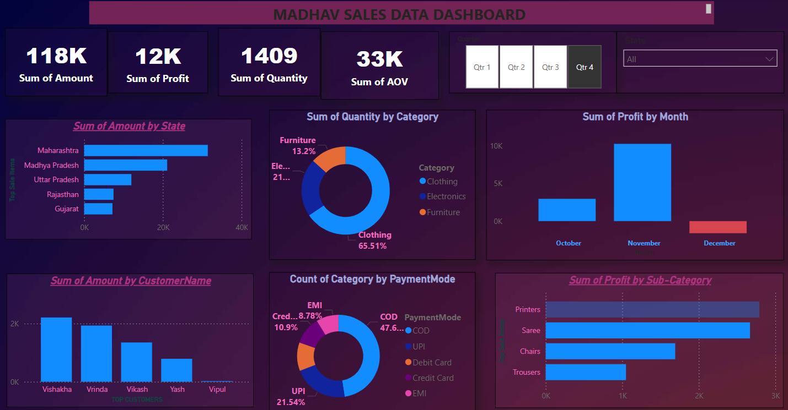

# POWER_BI

#Project 1
📊 Madhav Sales Data Dashboard – Power BI Project
This Power BI project presents an interactive sales data dashboard named "Madhav Sales Data Dashboard". It provides key business insights such as total amount, profit, quantity, and AOV (Average Order Value), along with visual breakdowns across states, categories, months, payment modes, and more.

📷 Dashboard Preview

📈 Key Insights Covered
✅ Total Amount, Profit, Quantity & AOV

🗺️ Top Selling States (e.g., Maharashtra, MP)

🧾 Sales by Customer

🛍️ Sales by Category & Sub-Category

💰 Payment Mode Analysis

📅 Monthly Profit Trend

📦 Category-Wise Quantity Distribution
.

📌 About This Project
This project was built as a Power BI practice project to demonstrate skills in:

Data cleaning

Data modeling

Interactive dashboard creation

Business insights generation

#Project 2
:** `$38.31`
- **Avg. Pizzas per Order:** `2.32`
- **Total Orders:** `21,350`
- **Total Revenue:** `$817.86K`
- **Total Pizzas Sold:** `50K`

## 📈 Visual Insights

### 1. 🔝 Top 5 Pizzas by Revenue
- **The Thai Chicken Pizza** - $43K
- **Vegetables + Vegetables Pizza** - $24K
- **Spinach and Feta Pizza** - $23K

### 2. 📅 Orders by Month
- **Peak Month:** July (1,935 orders)
- **Lowest Month:** October (1,646 orders)

### 3. 📆 Orders by Day
- **Most Active Day:** Friday (3.5K orders)
- **Least Active Day:** Sunday (2.6K orders)

### 4. 🍕 Avg. Pizzas per Order by Size
- Most popular size: **Large (23.71%)**
- XXLarge also has significant average per order values.

### 5. 🍽️ Revenue by Pizza Category
- **Classic:** $220.05K (Top Category)
- **Veggie, Chicken, Supreme** follow closely.

## 🛠️ Tools Used

- **Power BI** for data visualization
- **SQL** for data extraction and transformation
- **Excel/CSV** for data preprocessing (if applicable)

